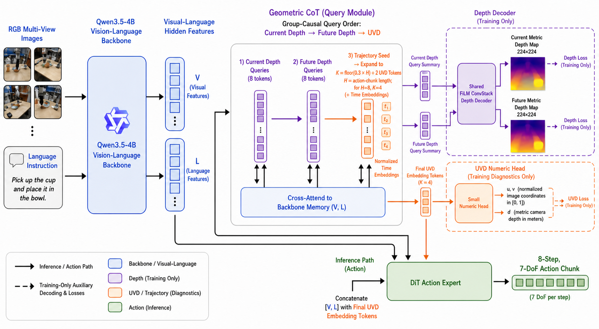
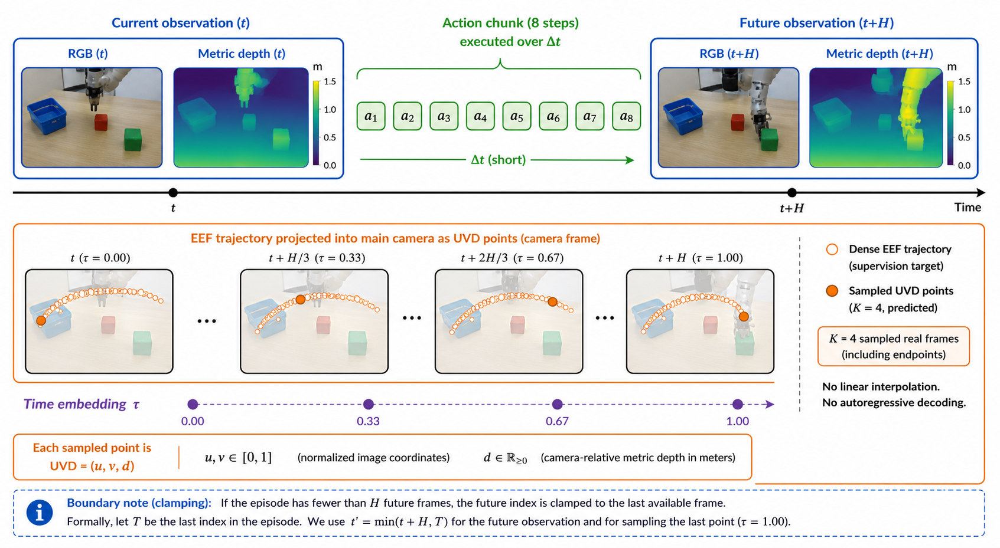

# Depth–UVD Geometric CoT V1

> 当前实现的完整设计说明、数据契约、训练/推理路径与验证边界
> 文档日期：2026-07-20
> 代码仓库：/home/yxz/CoT/CoT_vla

这份文档以当前代码和当前 60k 配置为准。此前讨论过、但没有进入代码的候选方案（例如 DPT、多尺度 decoder、UVD 自回归生成、SiLog loss、0–999 网络坐标）不会被当作 V1 已实现功能。

## Current implementation update (2026-07-29)

- Active auxiliary objective 只有 current depth、future depth 和 UVD regression。
- UVD 的 d 是 camera-space EEF reference-point depth；rendered depth map 是可见表面 depth。当前数据没有 visibility/occlusion target，因此代码中不实现二者的跨模态一致性 loss 或 diagnostic metric。
- 精度口径：Qwen3.5 VLM 按现有 wrapper 使用 BF16；CoT 的 Action Expert 不额外 `.float()`、不使用自定义 disabled-autocast，而是对齐原始 QwenGR00T baseline 的 action call/autocast 语义。不要把这句话解读为 Action Expert 保证纯 FP32 计算。

## 1. 一句话概括

V1 在 Qwen3.5-4B VLM 后面增加一个轻量的几何 CoT 模块：用当前深度 query、未来深度 query 和带时间编码的 UVD trajectory query 建立有顺序的几何中间表示；训练时用 current/future depth 和 EEF UVD 监督这些表示，推理时不显式解码深度或 UVD，只把最终 UVD embedding 与视觉-语言 hidden states 一起作为 DiT action expert 的条件，输出 8 步、7 DoF 的 action chunk。

核心假设是：

1. 当前观测几何有助于理解场景和操作对象；
2. action chunk 执行完成后的 future geometry 对动作规划有帮助；
3. UVD trajectory embedding 可以提供比单帧视觉特征更直接的时空几何约束；
4. 辅助几何 decoder 主要承担训练期的 representation shaping，推理期不增加显式几何生成路径。

## 2. 总体架构图

上图是论文风格的概念图。精确的 tensor shape、mask 和 loss 以本文后面的实现表为准。

## 3. Temporal data alignment

V1 将未来帧定义为 action chunk 对应的未来观测：

    current index = t
    future index  = min(t + H, episode_length - 1)
    H             = action_horizon = 8

因此这里的 future 不是任意挑选的下一帧，而是“当前观测之后执行完这一段 8-step action chunk 后能够对应到的观测”。如果 episode 尾部不足 H 帧，数据代码把 future index 截断到最后一个有效 index；不会访问越界，也不会用伪造的 future 帧。

## 4. 完整数据流

    RGB multi-view images + language instruction
                        |
                        v
                Qwen3.5-4B VLM
                        |
                        | final hidden states, hidden_states[-1]
                        v
            GeometricQueryReasoner
              |        |        |
              |        |        +--> UVD embedding tokens
              |        |
              |        +-----------> future depth query summary
              |
              +--------------------> current depth query summary

    Training only:
      current/future summary + primary-view image patch tokens
                        |
                        v
            shared FiLM ConvStack decoder
                        |
                 current/future metric depth

    Training diagnostics only:
      UVD embedding tokens -> numeric UVD head
                        |
               normalized u,v + metric camera depth

    Inference:
      concat([Qwen final hidden states, final UVD embedding tokens])
                        |
                        v
                 DiT action expert
                        |
                 8 x 7 action chunk

一个关键实现事实是：当前版本没有把三组 query 直接拼进 Qwen 的原始 token sequence，再让 Qwen 自身处理它们。Qwen 先独立完成一次前向并输出最后一层 hidden states；之后由 GeometricQueryReasoner 作为 post-backbone 模块读取 Qwen 的完整 hidden memory。

## 5. 输入和数据范围

### 5.1 模型输入

训练和评测都使用：

- 主视角 RGB 图像；
- wrist 视角 RGB 图像；
- 语言指令；
- 训练标签中的 depth、EEF UVD 和 action；
- 模型输入不包含 robot state。

当前配置中 include_state: false。虽然 action expert 的结构保留了 state_dim: 7 接口，但训练数据和 LIBERO 推理脚本没有向模型传 state，因此 V1 不能被描述为 RGB/state fusion。

### 5.2 图像预处理

当前数据管线使用 torchvision_av video backend，训练 dataloader 的 num_workers=4、persistent_workers=true、prefetch_factor=2，图像最终转成 PIL 并 resize 到 224 × 224。

多视角输入顺序为：

1. primary / agentview；
2. wrist。

几何监督暂时只使用 primary / agentview：

- current depth：primary view；
- future depth：primary view；
- UVD：EEF 投影到 primary camera；
- wrist RGB 仍然参与 Qwen 的视觉-语言理解。

数据根目录为：

    /root/data/yxz/datasets/libero_rerender

当前 libero_cot_all 由四个子数据集组成：

- libero object；
- libero goal；
- libero spatial；
- libero 10。

## 6. Qwen3.5 backbone 和 hidden states

V1 的视觉语言 backbone 为：

    /root/data/yxz/models/Qwen3.5-4B

关键设置：

- hidden size：由 Qwen 配置读取，当前模型接口按 backbone hidden size 工作；
- attention implementation：flash_attention_2；
- output_hidden_states=true；
- 几何模块使用 outputs.hidden_states[-1]，即 Qwen 最后一层 hidden states；
- 使用 Qwen 原有的 attention mask；
- 不在当前版本额外取 raw vision encoder 的多尺度中间 feature。

因此，当前 depth decoder 并不是“DPT 读取 Qwen encoder 多层 feature”的实现，而是：

    Qwen final hidden states
        -> primary-view image patch token extraction
        -> patch grid reshape
        -> shared FiLM ConvStack
        -> depth map

image patch 的空间网格从 primary-view image token 数量推断，不在代码中硬编码成 16 × 16。此前讨论的“256 个 depth latent tokens”不是 V1 的固定设计；V1 使用的是 8 个 depth query tokens，深度空间网格来自 Qwen 的 image patch tokens。

## 7. GeometricQueryReasoner

实现文件：

    starVLA/model/modules/geometric_cot.py

### 7.1 三组 query

| query group | 参数形式 | 当前数量 | 作用 |
|---|---:|---:|---|
| Current Depth Query | 独立可学习参数 | 8 | 表示当前观测几何 |
| Future Depth Query | 独立可学习参数 | 8 | 表示 action chunk 后的 future geometry |
| UVD Trajectory Query | 一个共享 trajectory seed + 时间编码 | 4 个运行时 token | 表示 current → future 的时空轨迹 |

Current 和 Future 使用独立初始化的 query 参数，但 depth decoder 共享权重。两组 query 的区别由 query embedding 和 backbone context 表达，不通过复制两套 decoder 增加参数。

UVD 不是“一个 query token 输出完整轨迹”，也不是每个点都定义一个独立的可学习参数。当前实现是：

    one shared trajectory_seed
        -> expand to K positions
        -> add time_embedding(tau_k)
        -> obtain K UVD query tokens

这样保留了共享轨迹先验，同时允许每个时间位置拥有不同的 token 表示。

### 7.2 时间编码和 K

当前 action horizon 为 H = 8，UVD 点数配置为 K = 4。

默认点数规则为：

    K = floor(0.3 * H) + 2

对于 H = 8：

    K = floor(2.4) + 2 = 4

时间位置使用归一化的真实采样时间：

    tau_k = (frame_index_k - current_index) / (future_index - current_index)

理想情况下首尾为 0 和 1。若 episode 尾部截断，分母使用实际的 current/future 有效间隔。数据 sampler 从 dense EEF supervision 中选择真实 frame index；不会对 UVD 中间点做线性插值。

如果可用真实 frame 数量少于 K，数据逻辑返回实际存在的点，不做 padding。模型 reasoner 可以根据运行时 uvd_times 的长度生成对应数量的 UVD token。V1 的常规训练设置仍然是 K = 4。

### 7.3 query attention mask

Qwen 原有的 V/L mask 保留不改。GeometricQueryReasoner 额外使用一张 group-causal mask，query 顺序为：

    [Current Depth] -> [Future Depth] -> [UVD]

实际可读关系为：

| 当前 query group | 可读取的 query group | 可读取 backbone memory |
|---|---|---|
| Current Depth | Current Depth | 是 |
| Future Depth | Current Depth、Future Depth | 是 |
| UVD | Current Depth、Future Depth、UVD | 是 |

因此三组 query 不存在相互双向自由 attention；它们按几何推理顺序形成单向依赖。每组内部是 full attention，这允许同一组 query 共享和整合信息。

注意：这里的 causal 是 geometric query 内部的 causal，不是把 Qwen 的原始 V/L mask 改成另一种语言模型 mask。Qwen 的 V/L 关系仍由 Qwen 自己的原始 attention mask 决定。

### 7.4 reasoner block

当前配置：

- query attention heads：16；
- reasoner layers：2；
- query dropout：0；
- 每层包含 query group-causal self-attention、query-to-backbone cross-attention、feed-forward block 和 normalization。

Cross-attention 的 memory 是 Qwen 最后一层完整 hidden sequence。它不是只看 image patch，也不是只看 language token；这样 query 可以同时利用视觉和语言上下文。

## 8. Depth branch

实现文件：

    starVLA/model/modules/depth_cot_decoder.py

### 8.1 当前选择

V1 选择“真实 image patch grid + shared ConvStack + FiLM”，没有引入 DPT 或 RefineNet 多尺度 decoder。

原因是 V1 先验证几何辅助监督是否能改善 action policy：

- 保留 Qwen 最后一层的空间 image token；
- 不依赖 Qwen 内部多层 feature 的稳定抽取接口；
- 参数和显存开销比完整 DPT 更容易控制；
- current/future 共享 decoder；
- 结构足够简单，便于定位辅助 loss、query 和 action condition 的作用。

### 8.2 具体 decoder

输入：

    primary image patch tokens: [B, N, D]
    depth query condition:       [B, D]

处理流程：

1. 根据 image token 数量推断 patch grid [H_p, W_p]；
2. reshape 为 [B, D, H_p, W_p]；
3. 1 × 1 convolution 投影到 256 个 feature channels；
4. 经过 3 个 residual Conv/GN/GELU stages；
5. 每个 stage 使用 query-conditioned FiLM；
6. 空间分辨率逐步上采样；
7. 最后 bilinear resize 到 224 × 224；
8. 输出 1-channel depth map；
9. 用 softplus(output) + 1e-4 保证预测深度为正。

FiLM 形式为：

    F' = (1 + gamma(q)) * F + beta(q)

其中 gamma 和 beta 由 depth query summary 生成。FiLM 投影使用接近零的初始化，使 decoder 初始时不会强烈破坏 backbone image feature。

当前 conditioning 不是简单相加，也不是 spatial feature 作为 query 的 cross-attention，而是 feature map 被 query 通过 FiLM 调制。

### 8.3 current/future 共享方式

Current Depth Queries 和 Future Depth Queries 使用同一个 SharedFiLMConvStack：

    current_query_mean -> shared decoder -> D_current
    future_query_mean  -> shared decoder -> D_future

因此 decoder 不能只靠一套独立卷积参数记忆“当前”和“未来”；它必须通过 query condition 和 backbone context 区分两个时间语义。

## 9. UVD branch

### 9.1 UVD 的定义

UVD 是 primary camera 中的：

    U = image horizontal coordinate
    V = image vertical coordinate
    D = camera-relative depth

EEF 世界坐标通过相机外参转换到 agentview camera frame，再用内参投影：

    X_camera = inverse(T_world_camera) @ [X_world, 1]
    [u', v', w'] = K @ X_camera
    u = u' / w'
    v = v' / w'
    d = X_camera[z]

这里的 depth 是相机光轴方向的 camera-space Z，也就是 metric depth map 使用的深度语义，不是 EEF 到相机的欧氏距离。

### 9.2 坐标归一化

原始数据仍保留 pixel coordinate。进入网络和 loss 前，当前实现把 resize 后的像素坐标转换为 [0, 1]：

    u_model = u_pixel / (image_width  - 1)
    v_model = v_pixel / (image_height - 1)
    d_model = d_meter / uvd_depth_scale

当前：

    image_size = 224
    uvd_depth_scale = 1.0

所以 V1 的实际语义是：

- 原始标注：像素坐标；
- 网络 U/V：[0,1]；
- 网络 D：米制数值；
- 当前没有使用 [-1,1] 作为 UVD 标签；
- 当前没有把标签量化到 0–999；
- 当前训练和 diagnostics 都不把 U/V 临时转换到 [-1,1] 做跨模态采样。

这一区分很重要：保存格式可以继续是像素坐标，但模型训练的 target 必须和预测 head 的范围一致。

### 9.3 UVD decoder/head

当前 UVD 分支不是自回归 decoder，也不对每个点使用一个独立的永久可学习 query 参数。每个 runtime UVD token 经过一个小的数值 head：

    Linear(D, D)
        -> GELU
        -> Linear(D, 3)

输出参数化为：

    u_hat = sigmoid(raw_u)
    v_hat = sigmoid(raw_v)
    d_hat = softplus(raw_d)

因此 U/V 自动落在 [0,1]，D 自动为正。K 个点是并行预测的。dense EEF 轨迹作为监督来源，训练 target 只取 K 个真实时间点。

### 9.4 当前没有处理的遮挡问题

代码有几何有效性 mask，例如：

- 投影结果有限；
- camera-space depth 大于 0；
- U/V 位于图像范围内；
- depth target 有效。

但 V1 没有显式的 EEF visibility / occlusion reasoning。若 EEF 被遮挡，pixel 上可见物体的深度可能比 EEF 更靠前。因此 V1 不把 depth map 的可见表面深度与 EEF reference-point depth 强制对齐，也不报告这种跨模态内部一致性指标。

## 10. Action expert

实现文件：

    starVLA/model/modules/action_model/GR00T_ActionHeader.py

### 10.1 Condition

当前推理 condition 的真实形式为：

    [Qwen final hidden sequence, final UVD embedding tokens]

概念上可写为：

    [V, L, UVD]

但代码层面没有把 V 和 L 另外池化成两个向量；last_hidden 保留 Qwen 序列中的视觉/语言 hidden states，再在末尾追加 UVD tokens。UVD tokens 的 condition mask 位置由全 1 mask 追加，表示 action expert 可以读取它们。

UVD 的 token 顺序在 condition 中位于 Qwen hidden states 之后：

    V/L first, UVD last

这不是把 UVD 当成最后一个 action token，而是把它作为 action expert 的额外 encoder condition。顺序本身不是当前 V1 的主要理论假设；真正重要的是 UVD embedding 被显式暴露给 action expert，并且其生成受 query causal structure 约束。

### 10.2 DiT 配置

当前 action expert 是 DiT-B 风格的 flow-matching action head：

| 参数 | V1 值 |
|---|---:|
| action model type | DiT-B |
| action dimension | 7 |
| action horizon | 8 |
| action hidden size | 1024 |
| diffusion/DiT layers | 16 |
| dropout | 0.2 |
| final dropout | true |
| normalization | ada_norm |
| inference denoising steps | 4 |
| training repeated diffusion steps | 8 |

DiT 内部把 action-side tokens 作为 hidden states，把 [V,L,UVD] 作为 encoder condition；action-side tokens 之间进行 self-attention，并通过 cross-attention 读取视觉、语言和 UVD condition。V1 不把 depth map 或 numeric UVD map 在推理时再次喂给 DiT。

### 10.3 Action loss

训练时使用 flow matching：

1. 采样 action chunk；
2. 采样噪声；
3. 根据时间变量构造 noisy action；
4. DiT 预测 velocity；
5. 对 predicted velocity 和 target velocity 做 MSE。

推理时从随机 action trajectory 开始，使用 4 次 Euler denoising 得到 8 × 7 的 normalized action chunk。环境侧再使用 LIBERO 的 normalization transform 还原到真实 action 范围。

## 11. Training-only geometry supervision

V1 的训练 forward 同时计算 action loss 和几何辅助 loss：

    L_total =
        1.00 * L_action
      + 0.14 * L_depth_current
      + 0.15 * L_depth_future
      + 0.62 * L_uvd

### 11.1 Current/future depth loss

当前使用 masked Smooth L1：

    L_depth = mean(SmoothL1(D_hat - D_target) over valid depth pixels)

分别计算 current 和 future depth。不是 L1、不是 MSE、不是 SiLog、也不是 log-depth loss。

Depth target 保持 metric meters。valid mask 会过滤无效 depth。V1 尚未系统比较 L1/MSE/SiLog/log-depth，因此这些仍是后续 loss ablation，不是当前实现。

### 11.2 UVD loss

当前使用 masked Smooth L1：

    L_uvd = mean(SmoothL1(UVD_hat - UVD_target) over valid points)

三个坐标使用相同坐标权重：

    weight_u = weight_v = weight_d = 1

因为 U/V 已归一化到 [0,1]，D 以米为单位，三个维度的原始数值尺度不完全相同；当前主要依靠总体 lambda_uvd 和实际训练曲线平衡，尚未做 per-dimension uncertainty weighting。

### 11.3 不使用跨模态 endpoint 约束

V1 不在 UVD endpoint 处采样预测 depth map，也不要求采样值等于 UVD 的 D。EEF reference point 可能被前景表面遮挡，二者在当前数据语义下并不保证相等；因此代码中没有对应 loss、helper 或 diagnostic metric。

### 11.4 Loss 权重的当前含义

当前权重不是“已经证明的最优比例”，而是第一版校准后的工程起点：

| loss | raw loss 示例（移除 geometry 前的 step 60000 校准） | weight | weighted contribution |
|---|---:|---:|---:|
| action | 0.0037787 | 1.00 | 0.0037787 |
| current depth | 0.0010377 | 0.14 | 0.0001453 |
| future depth | 0.0013536 | 0.15 | 0.0002030 |
| UVD | 0.0000426 | 0.62 | 0.0000264 |

上表的 weighted auxiliary 数字来自历史校准记录；新的 auxiliary/action 比例需要从短 pilot 重新记录。

## 12. LIBERO geometry data contract

### 12.1 数据字段

geometry loader 从 rerender 数据中的 episode metadata 和 NPZ 读取：

- observation.depth.image_m_path：depth map NPZ 路径；
- observation.camera.params_path：相机内参和外参；
- agentview_K：primary camera 内参；
- agentview_T_world_camera：world 到 camera 的变换；
- observation.state[:, :3]：EEF world XYZ，用于生成 UVD label；
- episode 长度和当前 sample index。

EEF 的姿态、夹爪等 state 不作为模型输入；这里只使用前三维来构造几何监督。

### 12.2 Depth target

current depth 使用当前 index 的 primary-view depth；future depth 使用 future index 的 primary-view depth。两者 resize 到 224 × 224：

- depth value：bilinear；
- valid mask：nearest；
- depth value 仍然是米制。

### 12.3 UVD target

EEF world XYZ 通过相机外参投影到 primary camera：

- camera-space Z 必须大于 0；
- U/V 必须在图像范围内；
- 坐标按 resize 后的图像大小重新缩放；
- loss target 使用 [0,1] U/V；
- D 使用 camera-space Z，单位为 meter；
- 从 dense trajectory 中选择真实 frame index；
- 不做中间点线性插值；
- episode 边界不足时只返回有效真实点，不 padding。

### 12.4 Action label

action 使用 LIBERO 的 7 维 delta-qpos 形式：

    x, y, z, roll, pitch, yaw, gripper

前六维使用数据集 min-max normalization，gripper 保持其二值/原有语义。模型输出为 normalized action，评测 wrapper 负责 unnormalize。

## 13. 当前训练配置

配置文件：

    examples/modelExtensions/CoT/configs/qwen35_gr00t_libero_CoT_v1.yaml

主要训练参数：

| 参数 | V1 值 |
|---|---:|
| max train steps | 60000 |
| warmup steps | 5000 |
| save interval | 15000 |
| eval/log interval | 100 |
| per-device batch size | 16 |
| canonical GPU count | 8 |
| global batch size | 128 |
| gradient accumulation | 1 |
| gradient checkpointing | true |
| base learning rate | 3e-5 |
| Qwen/VL interface learning rate | 1e-5 |
| action model learning rate | 1e-4 |
| scheduler | cosine with min lr |
| min lr | 1e-6 |
| AdamW beta | (0.9, 0.95) |
| weight decay | 1e-8 |
| max grad norm | 1.0 |
| Qwen attention | flash attention 2 |
| video backend | torchvision_av |
| dataloader workers | 4 |

当前没有冻结模块，freeze_modules 为空。训练时用了 ZeRO/distributed 训练框架；实际启动卡数由 launcher 的 NUM_PROCESSES 与 CUDA_VISIBLE_DEVICES 决定。

诊断开关在 canonical 60k 配置中默认关闭。短跑 calibration 时可以打开，用于记录：

- raw/weighted loss；
- action/aux loss ratio；
- 每个模块的 gradient norm 和 parameter RMS；
- depth MAE/RMSE；
- UVD normalized/pixel/depth MAE/RMSE；
- start/end point error；
- path length；
- data/model time；
- 显存和吞吐；
- prediction NPZ。

诊断样本默认是训练开始时第一个 batch 的前 4 个样本，不是独立 test set。

### 13.1 Shell 启动脚本设计准则

Shell 脚本只负责启动环境，不拥有训练超参数的第二份真值：

- YAML 是训练步数、保存间隔、学习率、batch、scheduler 和 diagnostics 的唯一默认来源；
- 脚本只处理 Python 环境、launcher、GPU 数量、端口、输出根目录和 run id；
- 脚本必须透传 `"$@"`，临时实验通过命令行 dotlist 覆盖 YAML；
- 脚本不应重复传入 `max_train_steps`、`save_interval` 等训练参数，避免脚本和 YAML 不一致；
- baseline 与 CoT 使用相同 launcher 约定，差异只来自各自 YAML 的 framework、dataset 和 CoT geometry 字段；
- 脚本启动前应通过 `bash -n`，并把实际使用的脚本和 YAML 复制到输出目录。

临时测试示例：

    --trainer.max_train_steps 15000
    --trainer.save_interval 5000

### 13.2 15k calibration decision

当前 LIBERO CoT V1 的 15k calibration run 使用：

    /root/data/yxz/outputs/qwen35_gr00t_libero_CoT_v1_5

在已完成的中段窗口（约 step 1550--7860）中，raw/weighted loss 和模块梯度显示：

- `lambda_action=1.0`；`lambda_depth_current=0.14`；
  `lambda_depth_future=0.15`；`lambda_uvd=0.62`；
- `aux/action` 从约 5--6% 降至约 3%；`action_fraction` 始终约 94--97%；
- step 7800 的 raw action loss 为约 `0.0542`，weighted auxiliary loss 为约
  `0.00177`；current/future depth raw loss 约为 `0.00340/0.00816`，UVD raw
  loss 约为 `1.06e-4`；
- step 7800 的 current/future depth MAE 约为 `0.025/0.033 m`，UVD XY MAE
  约为 `2.27 px`，UVD depth MAE 约为 `0.018 m`；
- query、depth decoder、UVD head 和 action expert 均持续产生有效梯度，未见
  auxiliary loss 压制 action loss 或辅助任务完全不学习的迹象。

因此本次 15k calibration **不调整 loss 权重**，YAML 继续保持上述值。理由是
辅助项已经提供稳定的几何训练信号，同时只占较小的总优化量；此时改权重没有
被日志或 diagnostics 支持，反而会破坏与已有 V1 结果的可比性。EEF 像素处的
UVD depth 可能被前景表面遮挡，因此不会与 depth map 的可见表面深度建立额外约束。

最终 step 已完成，最终 checkpoint 为：

    /root/data/yxz/outputs/qwen35_gr00t_libero_CoT_v1_5/checkpoints/steps_15000_pytorch_model.pt

最终窗口复核结果如下：

| window | action DiT loss | weighted auxiliary loss | aux/action | action fraction |
|---|---:|---:|---:|---:|
| steps 10010--15000 | 0.02487 | 0.000998 | 4.45% | 95.76% |
| steps 13010--15000 | 0.01873 | 0.000869 | 5.10% | 95.17% |
| steps 14010--15000 | 0.01770 | 0.000859 | 5.33% | 94.96% |

最终 step 15000 的 diagnostics 为：current/future depth MAE
0.01777/0.02098 m，UVD XY MAE 0.818 px，UVD depth MAE 0.01197 m。
最终窗口的平均梯度 norm 为：query 0.01177、depth decoder 0.05815、UVD
head 0.00651、action expert 0.33168；因此四类模块都仍在得到有效训练信号。

基于完整 15k 结果，**不调整 loss 权重**，YAML 保持
(1.0, 0.14, 0.15, 0.62)。最终窗口没有出现辅助项持续压制 action 的证据，单步
aux/action 的尖峰不作为改权重依据。

## 14. 历史 60k 运行证据（非本次闭环）

以下记录来自此前的 60k 运行，保留用于历史对照；它不是本次 15k 校准之后启动的
完整训练。本次完整训练的权重以当前 YAML 为准。

当前 60k 运行目录：

    /root/data/yxz/outputs/qwen35_gr00t_libero_CoT_v1_60k_8gpu

checkpoint：

    checkpoints/steps_15000_pytorch_model.pt
    checkpoints/steps_30000_pytorch_model.pt
    checkpoints/steps_45000_pytorch_model.pt
    checkpoints/steps_60000_pytorch_model.pt
    final_model/pytorch_model.pt

step 60000 的训练记录：

| metric | value |
|---|---:|
| total loss | 0.0042198 |
| action DiT loss | 0.0037787 |
| current depth raw loss | 0.0010377 |
| future depth raw loss | 0.0013536 |
| UVD raw loss | 0.0000426 |
| weighted auxiliary loss | 0.0004411 |
| auxiliary/action ratio | 0.1167 |
| action fraction | 0.8955 |
| model time | 3.15 s/step |
| throughput | 0.317 steps/s |

在固定的前 4 个训练诊断样本上，step 60000 的数值为：

| diagnostic | value |
|---|---:|
| current depth MAE | 0.01215 m |
| future depth MAE | 0.01247 m |
| current depth RMSE | 0.04313 m |
| future depth RMSE | 0.04109 m |
| UVD XY MAE | 1.71 px |
| UVD XY RMSE | 2.67 px |
| UVD depth MAE | 0.00207 m |
| UVD depth RMSE | 0.00254 m |
| start XY MAE | 3.00 px |
| end XY MAE | 2.45 px |
| start depth MAE | 0.00269 m |
| end depth MAE | 0.00166 m |
| predicted path length | 10.89 px |
| target path length | 8.67 px |
| path-length MAE | 2.25 px |

这些结果可以说明“训练和 decoder 正常收敛到可测的辅助目标”，但不能说明模型在 LIBERO held-out task 上的泛化或 success rate。

### 14.1 本次完整训练 handoff

15k 校准完成后已按 YAML 默认配置启动：

    output: /root/data/yxz/outputs/qwen35_gr00t_libero_CoT_v1_full_4gpu
    devices: CUDA 0,1,2,3
    world size: 4
    max_train_steps: 60000
    save_interval: 10000
    eval_interval: 100
    logging_frequency: 10
    diagnostics: disabled

启动参数不包含额外的 --trainer.* 覆盖；日志位于该 output 下的 logs/。因为默认
关闭 diagnostics，run_manifest.json、test_diagnostics.jsonl 和对应的诊断预测包
不会生成，这是预期行为，不代表训练未启动。训练日志已显示进入 1/60000，随后
继续运行到至少 5/60000。

## 15. 推理路径和 LIBERO 评测

推理时 predict_action 的路径是：

    RGB + language
        -> Qwen3.5 final hidden
        -> GeometricQueryReasoner
        -> final UVD embedding tokens
        -> concat([Qwen hidden, UVD tokens])
        -> DiT action expert
        -> normalized 8 x 7 action chunk
        -> LIBERO unnormalization

推理时不会调用：

- current depth decoder；
- future depth decoder；
- numeric UVD head；
- depth/UVD auxiliary loss。

因此 V1 的显式 geometry decoder 只产生训练监督和诊断输出，不会在 action inference 中额外生成 depth image 或 UVD 数值。

### 15.1 标准 LIBERO 60k 评测命令

下面的命令使用 4、5、6、7 号物理 GPU。因为评测脚本内部会根据 GPUS 分配进程，不要再在外层设置一个冲突的 CUDA_VISIBLE_DEVICES。

    cd /home/yxz/CoT/CoT_vla

    MODEL_DIR=/root/data/yxz/outputs/qwen35_gr00t_libero_CoT_v1_60k_8gpu \
    CKPT_NAME=checkpoints/steps_60000_pytorch_model.pt \
    LIBERO_HOME=/root/data/yxz/benchmarks/LIBERO \
    GPUS=4,5,6,7 \
    TASK_SUITE_NAME=all \
    NUM_TRIALS_PER_TASK=50 \
    SAVE_VIDEO=0 \
    USE_BF16=1 \
    bash examples/simBenchmarks/LIBERO/eval_files/run_multigpu_eval.sh

LIBERO-plus 复用相同的模型 server adapter，但任务环境脚本位于：

    examples/simBenchmarks/LIBERO-plus/eval_files/eval_libero.py

评测输入仍然是 primary + wrist 两张 uint8 RGB 图像，不传 state。现有评测 convention 中的图像旋转和 action unnormalization 由原 LIBERO wrapper 负责。

### 15.2 为何需要 libero_cot_all alias

训练数据 mix 名称是 libero_cot_all，但 LIBERO action normalization registry 使用 libero_franka。当前已在：

    starVLA/dataloader/gr00t_lerobot/mixtures.py

加入 alias，使 CoT checkpoint 在 server 侧仍能使用：

    robot_type = libero_franka
    unnorm_key = franka

这只解决 normalization registry 命名，不改变模型输入或 action head。

## 16. 代码地图

| 功能 | 文件 |
|---|---|
| CoT 主模型、训练/推理分支 | starVLA/model/framework/VLM4A/QwenGR00TCoT.py |
| group-causal geometric query | starVLA/model/modules/geometric_cot.py |
| shared FiLM depth decoder | starVLA/model/modules/depth_cot_decoder.py |
| depth/UVD losses | starVLA/model/modules/cot_losses.py |
| UVD projection、采样、resize 和 target pack | starVLA/dataloader/gr00t_lerobot/cot_geometry.py |
| LIBERO CoT dataset mix | starVLA/dataloader/cot_lerobot_datasets.py |
| dataset sample/image packing | starVLA/dataloader/gr00t_lerobot/datasets.py |
| action flow-matching / DiT head | starVLA/model/modules/action_model/GR00T_ActionHeader.py |
| CoT trainer 和 diagnostics | starVLA/training/train_starvla_cot_v1.py |
| 训练配置 | examples/modelExtensions/CoT/configs/qwen35_gr00t_libero_CoT_v1.yaml |
| 训练启动脚本 | examples/modelExtensions/CoT/scripts/run_qwen35_gr00t_libero_CoT_v1.sh |
| 多卡 LIBERO 评测 | examples/simBenchmarks/LIBERO/eval_files/run_multigpu_eval.sh |
| normalization alias | starVLA/dataloader/gr00t_lerobot/mixtures.py |

## 17. V1 已确定的设计决策

### 已实现

- Qwen3.5-4B 作为 VLM backbone；
- 使用最后一层 hidden states；
- primary/wrist 双视角 RGB + language；
- 不使用 robot state；
- current/future depth query 各 8 个；
- 一个共享 trajectory seed，运行时扩展为 K 个带时间编码的 UVD tokens；
- 默认 H=8、K=4；
- query group-causal 顺序：current depth → future depth → UVD；
- 同组内部 full attention；
- 每组 query cross-attend 到 Qwen final hidden memory；
- current/future 共享 FiLM ConvStack decoder；
- 224 × 224 positive metric depth prediction；
- UVD 并行 numeric head；
- U/V 使用 [0,1]，D 使用 meters；
- dense EEF supervision 中选择真实采样点；
- 不做 UVD 线性插值；
- action condition 为 Qwen final hidden + UVD final embedding；
- DiT action expert 输出 8 × 7 action chunk；
- training-only depth/UVD numeric decoding；
- action 1.0、current depth 0.14、future depth 0.15、UVD 0.62；
- torchvision AV backend；
- libero_cot_all normalization alias。

### 明确不属于 V1

- DPT/RefineNet 多尺度 decoder；
- 从 Qwen 多层 encoder feature 建立完整 feature pyramid；
- UVD 自回归生成；
- 每个 UVD 点一个独立的永久可学习 query；
- UVD 中间点线性插值；
- 0–999 量化坐标作为网络 target；
- [-1,1] 作为 UVD loss 的主坐标范围；
- 通过显式预测 depth/UVD map 再驱动 action expert；
- robot state fusion；
- EEF occlusion/visibility-aware cross-modal constraint。

## 18. Known / Assumptions / Unknowns / Evidence

### Known

- 当前代码会真正执行三组 query 的 geometric reasoning；
- 当前和未来 depth 使用共享 decoder；
- UVD query 使用时间 embedding；
- inference 不显式 decode depth 和 UVD；
- action expert 能读取 Qwen hidden 和 UVD embedding；
- 60k checkpoint 和 evaluation server 路径已存在；
- normalization smoke test 已通过。

### Assumptions

- action horizon 8 可以作为 current/future geometry 的时间间隔；
- EEF world XYZ 和 camera calibration 的坐标系在 rerender 数据中匹配；
- current/future depth 的共享 decoder 足以表达时间差异；
- final hidden image token 保留足够的空间结构；
- 4 个 UVD 点足以作为第一版 trajectory condition；
- 不输入 state 时，RGB 和 geometry supervision 能承担主要控制信息。

### Unknowns

- 几何 CoT 对 held-out LIBERO success rate 的实际提升；
- current depth、future depth 和 UVD 各自的因果贡献；
- K=4 是否适合所有 action horizon 和不同 FPS；
- future depth 是否真的比 current-only depth 带来额外 action benefit；
- Smooth L1 是否优于 MSE、L1、SiLog 或 log-depth；
- UVD 的 U/V/D 分维度 loss 是否需要不同权重；
- [V,L,UVD] 的 token 顺序和 UVD token 数量对 DiT 的敏感性；
- final-layer-only feature 是否优于多层 feature fusion；
- 60k 训练后的 model time 是否足以支持更大规模实验；
- 训练诊断指标和真实 LIBERO success rate 的相关性。

### Evidence boundary

当前 60k 数值来自训练日志和固定的前 4 个训练诊断样本。它们适合用于：

- 检查 loss 是否下降；
- 检查 depth/UVD decoder 是否能学习；
- 检查 mask、坐标变换和数值尺度；
- 检查梯度是否集中在某一模块；
- 检查是否有 NaN、无效 target 或进程/吞吐问题。

它们不适合直接作为：

- held-out depth accuracy；
- LIBERO test success；
- CoT 方法有效性的最终科学证据；
- 证明未来 depth 一定能提高控制的证据。

## 19. 下一步最小验证顺序

1. 用 steps_60000_pytorch_model.pt 跑标准 LIBERO 和 LIBERO-plus，得到 action success baseline。
2. 用独立 held-out episode 计算 depth/UVD metrics，避免继续使用训练开始时固定的 4 个样本。
3. 跑最小 action ablation：
   - baseline；
   - baseline + current depth；
   - baseline + current/future depth；
   - baseline + current/future depth + UVD。
4. 固定训练预算后比较 UVD K=2、4、6，保持 action horizon 不变。
5. 只有当 geometry branch 的 action benefit 稳定后，再比较：
   - Smooth L1 vs MSE/L1；
   - metric depth vs log-depth/SiLog；
   - final-layer feature vs 多层 feature；
   - FiLM vs concat/cross-attention。

## 20. 当前结论

V1 已经形成了一个闭环且可运行的研究系统：

    RGB + language
        -> Qwen3.5 representation
        -> ordered geometric query reasoning
        -> training-only depth/UVD supervision
        -> UVD embedding condition
        -> DiT action chunk

它的研究主张应暂时表述为：

> 通过按 current depth、future depth、UVD trajectory 排列的几何 query reasoning，并用训练期显式几何监督塑造 UVD embedding，VLA policy 可以获得一种面向 action chunk future state 的几何中间表示。

在完成独立 LIBERO/LIBERO-plus 评测和消融前，不应把“几何 decoder 的预测精度”直接等同于“控制性能提升”，也不应把固定训练样本上的 diagnostics 称为 test performance。
