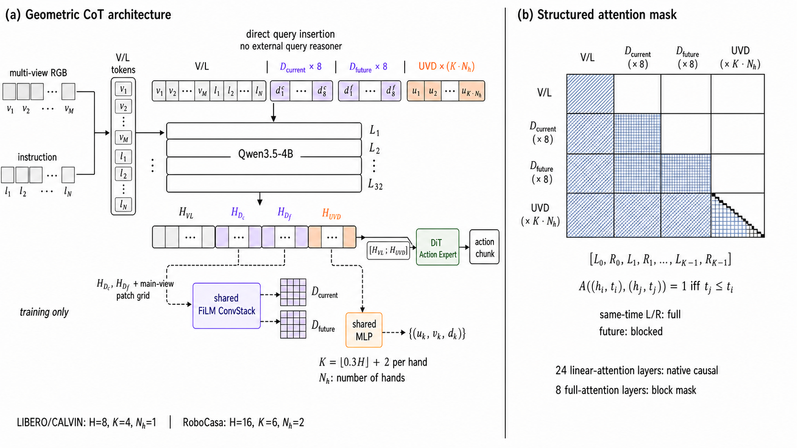

# Depth–UVD Geometric CoT V2

> **Design Report**
> **状态：Implemented — 审查修复后单测与四卡 distributed smoke 通过，待短训与闭环评测**
> **日期：2026-07-29**
> **适用工程：CoT_vla / Qwen3.5-4B + GR00T DiT Action Expert**

V2 将当前、未来深度和 EEF UVD 轨迹 query 直接插入 Qwen 的 token
序列，使几何 latent 参与 Qwen 的多层视觉—语言推理。V1 的共享深度
decoder、UVD 数值 head、辅助损失和 Action Expert 条件接口原则上保留。



> 上图的固定引用路径用于项目文档。若图片尚未生成，本文中的张量、mask 和数据流定义为 authoritative source。

## Executive summary

V1 在 Qwen 完成视觉—语言编码后，使用一个外置两层
`GeometricQueryReasoner`，让三组 query 对 Qwen 最后一层 V/L hidden states
做 cross-attention。该结构已经证明能够运行、训练和显式解码几何信息，但
query 本身不参与 Qwen 的 32 层多模态计算，几何推理深度受限，而且外置
reasoner 增加了约两层 full-width Transformer 计算。

V2 的核心改动只有一个：

```text
V1: Qwen(V/L) → external geometry reasoner → UVD → Action Expert

V2: Qwen([V/L, D_current, D_future, UVD]) → UVD → Action Expert
```

逻辑信息流保持：

```text
V/L → D_current → D_future → UVD
```

其中 depth query 在允许的 full-attention 层内组内互通，UVD query 按时间
causal。双手轨迹不做左右手硬隔离，而采用 time-major token 顺序和
temporal block-causal mask：同一时刻左右手互通，过去可见，未来不可见。

V2 的候选方法主张是：

> Directly integrating supervised geometric query tokens into a multimodal
> backbone can produce temporally structured predictive geometry latents that
> are more useful to an action expert than an external shallow query reasoner.

这只是可证伪假设。实现正确和辅助 loss 下降都不能单独支持该主张；必须通过
与 baseline、V1 和无几何监督 V2 的配对实验验证。

## At a glance

| 项目 | V2 决策 |
|---|---|
| Backbone | Qwen3.5-4B，hidden size 2560，32 个 text layers |
| Qwen attention | 24 层 linear attention + 每 4 层一次 full attention，共 8 层 |
| Query 位置 | 直接追加到 Qwen 多模态序列，不再经过外置 query reasoner |
| Token 顺序 | `[V/L, D_current, D_future, UVD]` |
| Depth query | current 8 个、future 8 个；每组在 full-attention 层内 full |
| UVD query | 一个共享 trajectory seed 运行时展开；一个 token 对应一个 UVD 点 |
| 单手 UVD | 按时间 causal：`U0, U1, ..., U(K-1)` |
| 双手 UVD | time-major：`L0,R0,L1,R1,...`；同时间双手 full，跨时间 causal |
| Depth decoder | 继承 V1：共享 FiLM ConvStack，主视角 224×224 metric depth |
| UVD head | 继承 V1：共享两层 MLP，输出归一化 `u,v` 和 metric `d` |
| Action condition | `[V, L, UVD_final] → GR00T DiT Action Expert` |
| 显式 decode | 训练和诊断可用；标准 action inference 不显式 decode |
| Active losses | Action + current depth + future depth + UVD；无跨模态 endpoint 约束 |

## 1. Context and conditions

### 1.1 V1 的当前事实

当前 V1 代码先运行 Qwen：

```text
RGB multi-view + instruction
            ↓
        Qwen(V/L)
            ↓
      H_VL_last
```

随后外置 `GeometricQueryReasoner` 使用两个相同结构的层：

```text
query self-attention
        ↓
cross-attention(query, H_VL_last)
        ↓
        FFN
```

因此 V1 的 query 能读取 Qwen 最后一层 V/L memory，但不能在 Qwen 的视觉—
语言层中逐层形成几何表征。

### 1.2 V2 要解决的阻塞问题

V2 首先回答一个结构问题：

> 当几何 query 是 action condition 的核心来源时，它是否应该参与完整
> multimodal backbone 的深层计算，而不是只读取最后一层表示？

选择直接插入 Qwen 的原因：

1. query 可以在多层中持续整合视觉、语言和前序几何 latent；
2. 不再额外复制两层 hidden size 2560 的外置 Transformer；
3. 逻辑上的几何 CoT 顺序可以直接由 backbone attention mask 表达；
4. V/L 与 UVD 最终 token 处在同一 representation space，Action Expert 接口更自然。

### 1.3 不在 V2 第一版中同时改变的内容

为保持因果归因，V2 第一版不同时引入：

- DPT 多尺度 depth decoder；
- 独立 current/future depth decoder；
- 自回归 UVD 数值生成；
- velocity/acceleration loss；
- gated Action Bridge；
- 从 baseline checkpoint 安装外置 adapter 的两阶段训练。

这些保留为独立 ablation 或后续插件方向。

## 2. Proposed architecture

### 2.1 主数据流

```text
RGB multi-view images + language instruction
                        ↓
Input embeddings:
[ native V/L embeddings
  current-depth queries
  future-depth queries
  time/hand-aware UVD queries ]
                        ↓
Qwen3.5-4B with hybrid group/block-causal attention
                        ↓
┌───────────────────────┼──────────────────────────┐
│                       │                          │
│ D_current / D_future  │ UVD final tokens         │ V/L final tokens
│                       │                          │
▼                       ▼                          │
Shared FiLM       Shared UVD MLP                   │
Depth Decoder     (training/diagnostics)           │
│                       │                          │
├─ current depth        └─ predicted UVD           │
└─ future depth                                    │
                                                    ▼
                                concat [V, L, UVD_final]
                                                    ↓
                                      GR00T DiT Action Expert
                                                    ↓
                                          predicted action chunk
```

### 2.2 V2 与 V1 的边界

| 模块 | V1 | V2 |
|---|---|---|
| V/L backbone | Qwen 只处理原始 V/L | Qwen 同时处理 V/L 和几何 query |
| Geometry reasoner | 外置两层 self/cross-attention | 删除；推理由 Qwen 层承担 |
| Query order | 外置 group-causal | Qwen 内部 group/block-causal |
| Depth decoder | Shared FiLM ConvStack | 保留 |
| UVD numeric head | Shared two-layer MLP | 保留 |
| Action condition | `[V,L,UVD]` | 保留 |
| 双手顺序 | hand-major | 改为 time-major |

## 3. Query construction

### 3.1 Current and future depth

两组 query 独立初始化：

\[
Q_c\in\mathbb{R}^{8\times2560},\qquad
Q_f\in\mathbb{R}^{8\times2560}.
\]

它们是 task-level latent，不对应固定图像 patch。主视角 patch 的二维空间结构
仍由 Qwen image tokens 保存；depth query 负责汇总 current/future 几何条件。

### 3.2 UVD query

参数层面只保留一个共享 trajectory seed：

\[
q_{\mathrm{traj}}\in\mathbb{R}^{1\times1\times2560}.
\]

每个时间点、每只手运行时构造一个 token：

\[
q_{h,k}^{UVD}
=q_{\mathrm{traj}}
+E_{\mathrm{time}}(\tau_k)
+E_{\mathrm{hand}}(h),
\qquad
\tau_k=\frac{k}{K-1}.
\]

单手任务不需要 hand embedding；双手任务使用独立 left/right hand embedding。
每个最终 UVD token 通过共享 MLP 回归一个点：

\[
\hat p_{h,k}=(\hat u_{h,k},\hat v_{h,k},\hat d_{h,k}).
\]

### 3.3 Temporal point count

默认每只手：

\[
K=\lfloor0.3H\rfloor+2,
\]

两个额外点对应起点和执行完整 action chunk 后的终点；中间点从真实 dense EEF
轨迹按相对时间均匀采样，不做线性插值。

当前项目配置为：

| Bench | Action horizon \(H\) | Hands | \(K\) per hand | UVD tokens |
|---|---:|---:|---:|---:|
| LIBERO | 8 | 1 | 4 | 4 |
| CALVIN ABCD→D / ABC→D | 8 | 1 | 4 | 4 |
| RoboCasa Fourier GR1 | 16 | 2 | 6 | 12 |

外部 CALVIN 标准协议常见 action chunk \(T=10\)，而当前项目 YAML 使用 \(H=8\)。
在声称严格遵循某个 CALVIN 协议前，必须单独审计 train/eval horizon；V2 不在
文档中自动把当前配置改成 10。

## 4. Attention design

### 4.1 Logical group order

目标信息流：

```text
V/L → D_current → D_future → UVD
```

其语义为：

- V/L 保留 Qwen 原生多模态 mask；
- current depth 可以读取 V/L；
- future depth 可以读取 V/L 和 current depth；
- UVD 可以读取 V/L、两组 depth latent 和不晚于自身的 UVD 时间；
- 后序 query 不反向改变前序 token。

### 4.2 Depth group-full

current 和 future 各自的 8 个 token 在允许的 full-attention 层中组内互通：

\[
A(D_c^i,D_c^j)=1,\qquad
A(D_f^i,D_f^j)=1.
\]

这不是严格的“先做一遍 depth self-attention，再做 cross-attention”。在同一个
Qwen full-attention 层中，一个 depth token 可以同时读取：

```text
前面的 V/L + 本组所有 depth tokens
```

Qwen 层间堆叠自然形成多轮融合。

### 4.3 Single-hand UVD temporal causal

单手 token 顺序：

```text
U0, U1, ..., U(K-1)
```

允许关系：

\[
A(U_i,U_j)=1\iff j\le i.
\]

模型并不是自回归生成 UVD 数值；所有 latent token 一次并行计算。causal mask
只规定信息流，数值仍由共享 head 并行回归。

### 4.4 Dual-hand temporal block-causal

V1 当前 target/token flatten 是 hand-major：

```text
L0,L1,...,L(K-1),R0,R1,...,R(K-1)
```

若直接施加普通 causal，`R0` 会看到左手未来 `L1...L(K-1)`，同时左手看不到
右手，产生时间泄漏和左右不对称。

V2 改为 time-major：

```text
L0,R0,L1,R1,...,L(K-1),R(K-1)
```

逻辑 mask 不依赖 hand identity，只依赖时间：

\[
A((h_i,t_i),(h_j,t_j))=1\iff t_j\le t_i.
\]

对应块矩阵：

```text
query time \ key time     t0      t1      t2
t0                       FULL     ×       ×
t1                       FULL    FULL     ×
t2                       FULL    FULL    FULL
```

每个 `FULL` 是左右手之间的 \(2\times2\) full block。因此：

- \(L_k\) 和 \(R_k\) 在同一时间可以协调；
- 两只手都可以读取双方过去；
- 任一手都不能读取任一手的未来；
- 不使用“左手和右手完全隔离”的硬 mask。

### 4.5 Qwen3.5 hybrid attention policy

本地 Qwen3.5-4B 配置有 32 个 text layers：

```text
[linear, linear, linear, full] × 8
```

V2 第一版采用：

- 24 个 linear-attention 层保持 Qwen 原生 causal 行为；
- 8 个 full-attention 层应用自定义 group/block mask；
- time-major 顺序保证 linear 层不发生跨时间未来泄漏；
- full 层周期性消除同一时间左右手的序列不对称，并让 depth 组内 full。

这是一种工程折中，不等于每一层都严格执行同一 block mask。若要所有 32 层都
完全满足同时间双手 full，需要修改 linear-attention kernel 或改变 token
表示，超出 V2 第一版范围。

### 4.6 Mask invariants

实现必须满足：

1. 追加任何 geometry query 后，前序 V/L token 不得读取它们；
2. current depth 不得读取 future depth/UVD；
3. future depth 不得读取 UVD；
4. UVD 时间 \(t_i\) 不得读取 \(t_j>t_i\)；
5. full-attention 层中同一时间的双手互相可见；
6. 原生 V/L padding 不能进入 Action Expert condition；固定 UVD query 在训练和推理
   始终全部激活，GT coordinate validity 只能用于 UVD regression loss。

## 5. Geometry decoders

### 5.1 Main-view image features

从同一次 Qwen forward 的最终 hidden states 中取主视角 image-token span：

\[
F_{\mathrm{main}}\in\mathbb{R}^{B\times N_p\times2560}.
\]

按真实 patch 顺序 reshape：

\[
F_{\mathrm{main}}^{2D}
\in\mathbb{R}^{B\times2560\times H_p\times W_p}.
\]

因为 V/L token 位于 geometry query 之前且保持 causal，它们不会反向读取 query。
future/current 条件通过对应 depth query 的最终 embedding 进入 FiLM，而不是
要求 image patch feature 本身被未来 query 改写。

### 5.2 Shared FiLM ConvStack depth decoder

current/future 共用同一个 decoder：

```text
main-view image token grid
        ↓ 1×1 projection: 2560 → 256
three residual Conv + GroupNorm + GELU stages
        ↓ bilinear upsampling
224×224 positive metric depth
```

每组 8 个 depth query 做 mean pooling：

\[
q_c=\operatorname{mean}(D_c),\qquad
q_f=\operatorname{mean}(D_f).
\]

共享线性层产生：

\[
(\gamma,\beta)=\operatorname{Linear}(q),
\qquad
F'=(1+\gamma)\odot F+\beta.
\]

FiLM 层零初始化，使训练初始阶段 decoder 近似不受 query 调制。输出使用
`softplus + 1e-4` 保证正深度。

### 5.3 UVD numeric head

每个 UVD final token 独立通过共享 head：

```text
Linear(2560, 2560) → GELU → Linear(2560, 3)
```

输出约束：

```text
u,v: sigmoid → [0,1]
d:   softplus → positive metric camera depth
```

该 head 并行解码 K 个点，不做 UVD 数值自回归。UVD final latent 无论是否显式
decode，都作为 Action Expert condition。

## 6. Action conditioning

标准 condition：

```text
[V_final, L_final, UVD_final]
                ↓
       GR00T DiT Action Expert
                ↓
          action chunk
```

Depth query 不直接拼给 Action Expert。它们通过 Qwen 内部
`D_current → D_future → UVD` 路径影响 UVD；保留 V/L 直连，避免强制几何
成为唯一信息瓶颈。

V2 第一版不改变 Action Expert 的层数、hidden size、diffusion/flow 参数、状态
输入和计算精度调用方式。baseline 与 V2 评测必须使用同一入口和相同精度开关。

## 7. Training and inference

### 7.1 Training

训练一次 Qwen forward 同时得到 V/L 和三组 geometry latent，然后：

```text
D_current → current depth decode → depth loss
D_future  → future depth decode  → depth loss
UVD       → numeric head         → UVD loss
[V,L,UVD] → Action Expert        → action loss
```

所有有效辅助 loss 都能通过 query 回传到 Qwen。depth/UVD decoder 参数只被对应
辅助分支更新；Action Expert 不依赖显式数值 decode。

### 7.2 Standard inference

```text
Qwen([V/L,D_current,D_future,UVD])
                  ↓
         [V,L,UVD_final]
                  ↓
          Action Expert
```

标准 action inference 不运行 depth decoder 和 UVD numeric head，但 geometry
query 必须运行，因为 UVD latent 是 action condition 的一部分。

### 7.3 Probe / visualization inference

诊断模式可额外运行：

- current metric depth；
- future metric depth；
- predicted UVD points；
- 与 GT 的并排可视化；
- Qwen、geometry extraction、depth decode、UVD head、Action Expert 的分段 latency。

该模式不能用于报告标准 action latency。

## 8. Training objective

当前 V1 的 active objective 继承为 V2 起点：

\[
\mathcal L=
\lambda_a\mathcal L_{\mathrm{action}}
+\lambda_c\mathcal L_{\mathrm{depth,current}}
+\lambda_f\mathcal L_{\mathrm{depth,future}}
+\lambda_u\mathcal L_{\mathrm{UVD}}.
\]

其中 V2 的 UVD 项进一步分解为：

\[
\mathcal L_{\mathrm{UVD}}
=\mathcal L_{\mathrm{absolute}}
+\lambda_r\mathcal L_{\mathrm{adjacent}},
\qquad \lambda_r=0.1.
\]

`absolute` 对所有有效 UVD 点做逐点 Smooth L1；`adjacent` 在 time-major
reshape 后，只比较同一只手相邻真实时间槽的 \((u,v,d)\) 增量。外层
`lambda_uvd=0.62` 再统一控制整个 UVD 任务相对 Action/Depth 的贡献。

初始配置：

| Loss | 形式 | 起始权重 |
|---|---|---:|
| Action | GR00T Action Expert 原生 objective | 1.00 |
| Current depth | valid-pixel masked Smooth L1 | 0.14 |
| Future depth | valid-pixel masked Smooth L1 | 0.15 |
| UVD | all-point Smooth L1 + 0.1 × adjacent-delta Smooth L1 | 0.62 |

Depth/UVD loss 内部转为 FP32 计算 Smooth L1。UVD 对 `u,v,d` 使用相同
coordinate weight，并分别记录 absolute/relative 的 raw/weighted loss，以及 U、V、D 的
raw loss 与误差。由于单位和自然尺度不同，后续权重判断仍需结合共享参数 gradient norm
和与 action gradient 的 cosine，不能只看总 loss。

代码中不实现 depth-map/UVD endpoint loss 或 diagnostic metric，原因是：

- UVD 的 \(d\) 是 EEF reference point 的相机坐标深度；
- rendered depth map 在对应像素保存最前方可见表面；
- 遮挡时二者不等；
- 当前没有 visibility/occlusion target，强制相等会引入错误监督。

权重是 V2 的可比较起点，不是理论最优值。只有诊断显示某一辅助任务对共享
Qwen/query 的梯度严重失衡，才调整权重。

## 9. Data contract

### 9.1 Temporal alignment

对于 current observation \(o_t\) 和 action chunk 长度 \(H\)：

```text
current depth target = D_t
future depth target  = D_{t+H}
UVD start            = EEF UVD at t
UVD end              = EEF UVD at t+H
action target        = actions executed between them
```

若 episode 剩余长度不足 H，future target 使用 episode 最后一个有效 observation；
中间轨迹只使用真实存在帧并通过 valid mask 表达有效性，不构造线性插值标签。

### 9.2 Coordinates

- 原始 `u,v` 按原图像像素坐标保存；
- Qwen resize/crop 后同步变换到模型主视角；
- 网络 target 使用连续 `[0,1]`；
- 投影点只有落在像素中心可表示范围 `0 <= u <= W-1`、`0 <= v <= H-1` 且 `d > 0` 时才参与 UVD loss；
- 真正越界点使用 per-point invalid mask，不截到图像边缘；归一化后只为浮点舍入做 `[0,1]` clamp；
- 只有 `grid_sample` 等 API 需要时临时变换到 `[-1,1]`；
- `d` 保持相机坐标系 metric depth；
- depth map 和 UVD 必须使用同一相机定义和相同预处理几何。

### 9.3 Fixed K and validity

模型配置决定每只手的固定 \(K\)。dense EEF trace 必须在 dataloader 中均匀采样
到 \(K\) 个时间槽；模型不允许根据 raw dense length 隐式增加 query 数量。

双手 target 和 query 必须同时采用 time-major flatten：

```text
[time, hand, 3]
        ↓
[L0,R0,L1,R1,...]
```

训练与推理 token 数、attention topology 和 query time embedding 必须一致：所有固定
query slot 始终存在并使用 \(\tau_k=k/(K-1)\)。缺失帧或无效坐标不改变 token layout，
其 valid mask 只屏蔽数值监督，不能作为 Qwen 或 Action Expert 的输入。

## 10. Implementation boundary

V2 实现应新增相邻文件和新 framework registry name，不直接破坏 V1：

1. 新建 V2 geometry token builder；
2. 新建 V2 attention-mask builder；
3. 新建 QwenGR00TCoT V2 framework；
4. 复用 `SharedFiLMConvStack` 和 `cot_losses.py`；
5. 将双手 geometry target flatten 改为 time-major 的 V2 专用路径；
6. 新建 V2 YAML 和启动脚本；
7. V1 checkpoint、配置和评测入口继续可运行。

需要在实现计划中定位的接口：

- 如何通过 `inputs_embeds` 或保留 token ID 的方式追加 learnable queries；
- geometry query 的 position IDs / mRoPE 语义；
- Qwen3.5 full-attention 层接收 4D custom mask 的具体路径；
- FlashAttention 2 是否接受目标 block mask，必要时哪些层切换到可表达 mask 的实现；
- 如何从扩展序列中稳定切分 V/L、depth 和 UVD spans；
- cache/use_cache 在训练和 action inference 下的行为。

V1 的 `GeometricQueryReasoner` 参数与 V2 query-in-backbone 结构不直接兼容。
是否迁移 query/decoder 权重是独立实验决策；V2 第一版优先从相同 baseline
checkpoint 公平初始化。

## 11. Key findings and implications

### 11.1 Direct insertion strengthens representation coupling

V2 让 geometry latent 在 Qwen 层内形成，而不是仅对最后一层 V/L memory 做两轮
读取。若 V2 优于 V1，合理解释是更深的多模态交互或更合适的 representation
space；不能仅凭结果宣称模型进行了人类式 CoT。

### 11.2 Causal order does not imply numeric autoregression

UVD token 的 causal attention 是 latent information constraint。所有点依旧一次
并行回归，因此不会产生 K 次 Action Expert 前向，也不会把训练变为 teacher
forcing 数值序列。

### 11.3 Dual-hand mask must model time before identity

硬隔离左右手会损失双臂协调；hand-major causal 会发生未来泄漏。time-major
temporal block-causal 同时满足协同和因果性，是 V2 双臂任务的默认选择。

### 11.4 V/L invariance is a decisive implementation check

geometry token 都位于原始 V/L 之后。正确的 causal 实现中，追加 query 不应改变
同一输入上前序 V/L hidden states。若变化超过合理数值误差，说明 mask、position
或 attention 实现与设计不一致。

## 12. Validation plan

### 12.1 P0 — code matches the intended algorithm

在任何长训练前完成：

| Check | Intervention | Required observation |
|---|---|---|
| Span/shape | 单手和双手 synthetic batch | `8 + 8 + K×hands` query 数准确 |
| V/L invariance | 同输入分别运行有/无 appended queries | 原始 V/L positions 输出在容差内一致 |
| Group mask | 输出实际 allowed-read matrix | current/future/UVD 边界与设计一致 |
| Future leakage | 扰动未来 UVD input embedding | 更早 UVD token 不发生变化 |
| Same-time hands | full-attention 层检查 `Lk↔Rk` | 双向可见 |
| Time-major target | 人工标记左右手坐标 | token/head/target 完全同序 |
| Fixed K | dense trace 长度大于 K | dataloader 均匀采样，不增加模型 token |
| UV boundary | 最后像素中心与其外侧连续坐标 | `W-1` 有效，`W-1 < u < W` 无效 |
| Relative mask | 双手 time-major 且含 invalid 中间点 | 只比较同手相邻且两端有效的 segment |
| Train/infer parity | 同一 YAML 的 train/predict | UVD token 数和顺序相同 |
| Gradient paths | 分别 backward 各 raw loss | 梯度只流向预期模块且共享 Qwen 有非零梯度 |
| Optional decode | 关闭 decoder forward | action 输出接口仍可运行 |

### 12.2 P1 — optimization smoke

建议顺序：

1. 单卡 2–12 step shape/NaN/显存 smoke；
2. 四卡短训练确认 distributed mask 和 checkpoint；
3. 记录普通 step 与诊断 step 的分段 latency；
4. 运行 1k–5k 检查 absolute/relative、U/V/D、相邻位移、边界比例和 raw/weighted loss；
5. 再决定是否跑 15k loss calibration。

只有 P0 全部通过，长训练才有解释价值。

### 12.3 P2 — smallest scientific comparison

使用同一 baseline checkpoint、数据顺序、batch、optimizer、scheduler 和评测
episode seeds：

| Experiment | Geometry path | Auxiliary supervision | Purpose |
|---|---|---|---|
| A | none | none | baseline |
| B | V1 external reasoner | depth + UVD | 当前方法 |
| C | V2 direct-in-Qwen | depth + UVD | 检验直接深层融合 |
| D | V2 direct-in-Qwen | none | 排除额外 token/参数本身收益 |

如果资源有限，最阻塞的比较是 `B vs C`；若 `C > B`，仍需 `D` 才能区分收益来自
几何监督还是结构变化。

### 12.4 Mechanism checks

在同一个 V2 checkpoint 上进行：

- 将 `UVD_final` 置零；
- batch 间打乱 `UVD_final`；
- 保留 UVD token 但关闭 depth/UVD auxiliary loss 的对照；
- 可选地只移除 future-depth 可见性。

若动作几乎不变，说明 Action Expert 可能绕过 UVD，不能以 decode 质量支持动作
机制主张。

## 13. Risks and mitigations

| 风险 | 影响 | 首选检查/处理 |
|---|---|---|
| FlashAttention 2 不表达自定义 block mask | 设计无法忠实实现 | 先做最小 mask API probe，再决定 full 层 backend |
| mRoPE/position IDs 与追加 query 不兼容 | query 表示或长度错误 | synthetic forward + position 可视化/断言 |
| linear 层只有普通 causal | depth full 和同时间双手 full 只周期性发生 | 作为 V2 第一版显式假设；后续 ablation |
| V/L 被追加 token 反向影响 | 违反因果设计 | V/L invariance 单测 |
| time-major target 与 token 不一致 | 双手监督错位 | 带唯一标识的 target-order 单测 |
| Action Expert 忽略 UVD | decode 好但动作无收益 | UVD zero/shuffle intervention |
| 辅助梯度压过 action | 闭环性能下降 | raw/weighted loss + shared-gradient norm/cosine |
| future geometry 多模态 | Smooth L1 学平均未来 | 先观察误差分布；后续再考虑分布式预测 |
| 遮挡导致 UVD depth 与 visible depth 不一致 | 错误的跨模态比较 | 不实现该约束；分别按各自 GT 评估 |

## 14. Recommendations

1. 先实现最小 direct-query Qwen forward 和 mask 单测，不接 decoder。
2. 通过 V/L invariance、双手时间 mask 和 train/infer K parity 后，再复用 V1 decoder。
3. V2 第一轮保持 V1 active loss 与 Action Expert 参数不变。
4. 第一轮只比较 baseline、V1、V2，不同时引入 adapter/gated bridge/DPT。
5. 把 CALVIN `H=8` 与目标评测协议单独审计，不把 horizon 变更混入 V2 结构实验。
6. 只有在 V2 比 V1 稳定提升后，再讨论“直接几何 CoT”作为论文主方法；否则回到
   外置 adapter 支线或分析 mask/optimization failure。

## 15. Research State

### Known

- 当前 Qwen3.5-4B 为 32 层：24 linear attention、8 full attention。
- V2 已作为独立 `QwenGR00TCoTV2` framework 实现；V1 文件和 registry name 未修改。
- 真实 Qwen3.5-4B 多模态前向已确认：24 个 linear 层接收原生 2D mask，
  8 个 full 层使用 SDPA 接收 V2 4D mask，视觉 patch scatter 与 mRoPE 可运行。
- 扰动最后一个 UVD embedding 后，其前全部 token 的最大绝对变化为 0，说明实测未发生
  future-token leakage；被扰动 token 自身发生明显变化。
- 单样本完整 forward/backward 中 Qwen、geometry token、depth decoder、UVD head 和
  Action Expert 均获得有限非零梯度。
- V1 query 只读取 Qwen 最后一层 V/L hidden states，外置 reasoner 有两层。
- V1 depth decoder 是共享的 3-stage FiLM ConvStack。
- V1 UVD head 是共享两层 MLP，一个 token 回归一个 UVD 点。
- 当前 active auxiliary losses 只有 current depth、future depth 和 UVD，均为 masked Smooth L1。
- V1 模型内部将 RoboCasa 双手 target pack 为 hand-major，不能直接复用于 V2。
- RoboCasa loader 实际保留 `[T,2,3]` 双手轴；V2 专用 packer 将其转为 time-major，
  因而无需修改共享 loader，也不会让 dense/raw trace 改变固定 token 数。

### Assumptions

- 周期性的 8 层 full group/block attention 足以补充 24 层原生 causal linear attention。
- 直接进入 Qwen 的 geometry token 会比外置两层 reasoner形成更有用的 action condition。
- 保留 `[V,L]` 直连可以避免 geometry 预测不准时完全破坏动作。
- 共享 current/future depth decoder 仍适用于 V2。

### Unknowns

- 8 个 depth query 是否仍是合理容量。
- Action Expert 是否实际使用 UVD，而不是主要依赖 V/L。
- 现有 loss 权重在 query 进入 Qwen 后是否仍保持合理梯度比例。
- V2 在正式 batch/worker 配置下的吞吐，以及闭环成功率相对 V1 的真实变化。
- CALVIN 当前 \(H=8\) 是否与最终采用的标准评测协议一致。

### Evidence

- 代码检查确认 V1 reasoner、decoder、head、loss 和 hand-major target 的实际实现。
- 本地 Qwen config 确认 32 层 hybrid attention 组成。
- 审查修复后 18 个 V2 聚焦测试通过；双手 time-major diagnostics 与共享回归也通过。
- 本地真实 Qwen3.5-4B + 224×224 图像 smoke 输出 `[1,100,2560]` 和
  `[3,1,100]` mRoPE position IDs；full text attention backend 为 SDPA。
- 完整单样本 forward/backward 得到有限 Action/Depth/UVD/total loss，并确认五类模块
  梯度路径均存在。该 smoke 只验证工程连通性，不代表优化效果。
- 一次修复前的四卡 2-step distributed smoke 验证了真实 LIBERO dataloader、ZeRO-2、
  action eval、checkpoint 保存与 strict state-dict key 对齐；steady-state 第 2 步 model
  time 约 0.92 s，单卡 max allocated 约 30.6 GiB。独立审查随后发现 GT-valid/time 的
  train/infer mismatch 并已修复，因此该 checkpoint 不可作为续训起点。
- 修复后的四卡 2-step distributed smoke 已在真实 LIBERO 数据、ZeRO-2、每卡 batch 1
  上通过：两步 Action/Depth/UVD/total loss 均为有限值，step 2 steady-state model time
  约 0.73 s，单卡 max allocated 约 30.6 GiB；action eval、geometry diagnostics、
  prediction NPZ、step-2 checkpoint 和 final model 均成功生成。step-2 checkpoint
  在 CPU 上以 `strict=True` 重载得到 `missing=[]`、`unexpected=[]`。
- 已有 V1 训练和评测证明整条工程路径可运行，但现有结果不能隔离 query 深度、
  loss 权重、学习率和数据变化的影响。
- V2 尚无 1k–5k 优化趋势、正式配置吞吐或闭环评测证据。

### Next decisive question

当前最阻塞的问题已从 mask API 转为优化与机制证据：

> 在保持 baseline/V1 训练预算和数据顺序可比时，V2 的 auxiliary 梯度是否帮助而非
> 干扰 action，并且 Action Expert 是否实际使用 `UVD_final`？

该问题需要短训练诊断与 UVD zero/shuffle intervention 回答，不能由 smoke test 推断。

## Conclusion

V2 是对 V1 的单一、可归因架构升级：把几何 query 从外置浅层 reasoner 移入
Qwen 主干，同时保留已经跑通的 depth/UVD decode 和 Action Expert 接口。

其关键不在于增加更多模块，而在于精确定义信息流：

```text
Depth: group-full
UVD: temporal causal
Dual hand: same-time full + cross-time causal
Action: [V,L,UVD_final]
```

下一阶段首先验证 mask 和 token 对齐，而不是直接长训。只有在实现忠于该设计后，
V2 与 V1/baseline 的闭环对照才可以用于支持或否定论文方法主张。

## Appendix A — V1 to V2 code map

| Current V1 location | V2 action |
|---|---|
| `starVLA/model/modules/geometric_cot.py` | 保留给 V1；新增 V2 token/mask builder |
| `starVLA/model/framework/VLM4A/QwenGR00TCoT.py` | 保留给 V1；新增 V2 framework |
| `starVLA/model/modules/depth_cot_decoder.py` | 复用 |
| `starVLA/model/modules/cot_losses.py` | 复用 active losses |
| `starVLA/dataloader/gr00t_lerobot/cot_geometry.py` | 复用采样语义；新增/切换 V2 time-major flatten |
| `examples/modelExtensions/CoT/configs/*_CoT_v1.yaml` | 复制为独立 V2 YAML，删除外置 reasoner 参数 |

V2 YAML 不再需要 `query_num_heads`、`query_layer_count` 和 `query_dropout`；
`depth_query_count`、`uvd_num_points`、`uvd_hand_count`、decoder 参数和 loss
权重继续有效。

## Appendix C — Implemented file map and current gate

| Responsibility | V2 file |
|---|---|
| Geometry layout, embeddings, masks, fixed time-major targets | `starVLA/model/modules/geometric_cot_v2.py` |
| Cache-free Qwen3.5 hybrid-mask forward | `starVLA/model/modules/qwen35_geometry_forward.py` |
| Independent framework and train/inference APIs | `starVLA/model/framework/VLM4A/QwenGR00TCoTV2.py` |
| CoT diagnostics-compatible trainer entry | `starVLA/training/train_starvla_cot_v2.py` |
| Bench configs | `examples/modelExtensions/CoT/configs/qwen35_*_CoT_v2.yaml` |
| Four-card launchers | `examples/modelExtensions/CoT/scripts/run_qwen35_gr00t_*_CoT_v2.sh` |

当前 gate：代码级 P0 的 shape、mask、固定 query schedule、target order、真实多模态
前向、future leakage、无-GT geometry inference、双手 diagnostics 和五模块梯度连通性
已经验证；修复后 2-step 四卡 distributed smoke、诊断产物、checkpoint 保存和 strict
重载也已通过。下一步应做 1k–5k 诊断训练并检查梯度竞争与 UVD 使用情况，不应直接
启动完整长训。

## Appendix B — Artifact and source notes

- 本报告以仓库 Markdown 为 canonical artifact。
- Design Report 模板要求的 Executive Summary、Key Findings、Implications、
  Recommendations、Conclusion 和 Appendix 已映射到本文结构。
- 当前会话没有连接的 DOCX 文档控制会话，且本机未发现 Pandoc/LibreOffice，
  因此未生成可验证的模板 DOCX 副本。
- V1 canonical reference：
  [`../v1/depth-uvd-cot-v1-complete.md`](../v1/depth-uvd-cot-v1-complete.md)。
- Adapter 支线：
  [`../geometric_cot_adapter_idea.md`](../geometric_cot_adapter_idea.md)。
